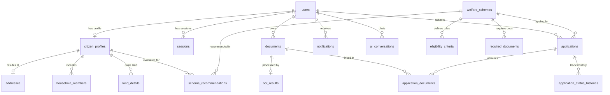

# Database Design & Architecture Specification - BenefitOS Platform

| Field | Value |
|-------|-------|
| Document Title | Database Architecture Specification |
| Version | 2.0.0 |
| Engine | PostgreSQL 15+ / Supabase |
| ORM | Prisma ORM 6.x |
| Security Model | Row Level Security (RLS) + Encrypted PII |

---

## 1. Database Architecture Overview

The BenefitOS relational database schema is strictly derived from the backend domain model and Prisma schema (`apps/backend/prisma/schema.prisma`).

---

## 2. Table-by-Table Technical Breakdown

### 2.1 `users` Table
- **Purpose**: Authenticated account identity, role, and credentials.
- **Columns**: `id` (UUID PK), `email` (VARCHAR UNIQUE), `phone` (VARCHAR UNIQUE), `passwordHash` (TEXT), `role` (ENUM: `CITIZEN`, `ADMIN`, `OFFICER`, `AUDITOR`), `mfaEnabled` (BOOL), `googleId` (VARCHAR UNIQUE), `createdAt`, `updatedAt`, `deletedAt`.
- **Referenced By**: `Session`, `CitizenProfile`, `Document`, `Application`, `Notification`.
- **RLS Policy**: Users view/update own user record. Admins view all records.

### 2.2 `citizen_profiles` Table
- **Purpose**: Citizen demographic, economic, and identity attribute store.
- **Columns**: `id` (UUID PK), `userId` (UUID FK UNIQUE), `firstName`, `lastName`, `dateOfBirth`, `gender`, `maritalStatus`, `socialCategory`, `employmentStatus`, `annualIncomeINR`, `disabilityType`, `disabilityPercent`, `isBplCardHolder`, `aadhaarHash` (TEXT UNIQUE), `panHash`.
- **Referenced By**: `Address`, `HouseholdMember`, `LandDetail`, `SchemeRecommendation`.
- **Indexes**: `idx_citizens_annual_income` (`annualIncomeINR`), `idx_citizens_social_category` (`socialCategory`).
- **RLS Policy**: Citizen views/updates own profile. Officers/Admins view profiles for application auditing.

### 2.3 `welfare_schemes` Table
- **Purpose**: Welfare scheme catalog definitions and benefit amounts.
- **Columns**: `id` (UUID PK), `code` (VARCHAR UNIQUE), `title`, `description`, `category` (ENUM), `department`, `state`, `isCentralScheme`, `financialBenefit`, `isActive`, `applicationDeadline`.
- **Referenced By**: `EligibilityCriteria`, `RequiredDocument`, `SchemeRecommendation`, `Application`.
- **Indexes**: `idx_schemes_category_active` (`category`, `isActive`).

### 2.4 `scheme_recommendations` Table
- **Purpose**: Calculated scheme eligibility recommendations per citizen.
- **Columns**: `id` (UUID PK), `citizenProfileId` (UUID FK), `schemeId` (UUID FK), `matchPercentage` (FLOAT), `estimatedBenefit` (FLOAT), `isEligible` (BOOL), `criteriaMet` (TEXT[]), `missingCriteria` (TEXT[]), `missingDocuments` (ENUM[]).
- **Constraints**: UNIQUE (`citizenProfileId`, `schemeId`).
- **Indexes**: `idx_recommendations_match` (`citizenProfileId`, `matchPercentage` DESC).

### 2.5 `documents` & `ocr_results` Tables
- **Purpose**: Citizen uploaded documents and extracted OCR intelligence text/json.
- **Columns (`documents`)**: `id` (UUID PK), `userId` (UUID FK), `documentType` (ENUM), `fileName`, `fileSize`, `mimeType`, `storagePath`, `verificationStatus`.
- **Columns (`ocr_results`)**: `id` (UUID PK), `documentId` (UUID FK UNIQUE), `rawText`, `confidenceScore`, `extractedData` (JSONB).

### 2.6 `applications` Table
- **Purpose**: Citizen welfare application submissions and status tracking.
- **Columns**: `id` (UUID PK), `applicationNo` (VARCHAR UNIQUE), `userId` (UUID FK), `schemeId` (UUID FK), `status` (ENUM: `DRAFT`, `SUBMITTED`, `UNDER_REVIEW`, `APPROVED`, `REJECTED`), `formData` (JSONB).
- **Indexes**: `idx_applications_user_status` (`userId`, `status`).

### 2.7 `outbox_events` Table
- **Purpose**: Transactional outbox event store for dual-write reliability.
- **Columns**: `id` (UUID PK), `aggregateType`, `aggregateId`, `eventType`, `payload` (JSONB), `status` (ENUM: `PENDING`, `PUBLISHED`), `createdAt`.
- **Indexes**: `idx_outbox_status_created` (`status`, `createdAt`).

---

## 3. Row Level Security (RLS) Policy Summary

All tables in Supabase have Row Level Security enabled.
- **Citizen Isolation**: Citizens can ONLY select/insert/update records matching `auth.uid() = userId` or `citizenProfile.userId = auth.uid()`.
- **Officer & Admin Access**: Users with claims `role IN ('OFFICER', 'ADMIN', 'SUPER_ADMIN')` can access application and verification data.
- **Public Schemes Catalog**: Active schemes (`isActive = true`) are publicly readable for scheme discovery.

---

## 4. Performance Strategy

1. **Composite & Partial Indexing**:
   - `idx_schemes_category_active` on `(category, isActive)` accelerates scheme catalog browsing.
   - `idx_recommendations_match` on `(citizenProfileId, matchPercentage DESC)` enables instant dashboard loading (< 50ms).
   - `idx_outbox_status_created` on `(status, createdAt)` allows `OutboxRelayWorker` to fetch pending events without full table scans.
2. **JSONB Querying**: `ocr_results.extractedData` and `applications.formData` use PostgreSQL `JSONB` for indexing nested document keys.
3. **Partitioning Readiness**: `audit_logs` and `outbox_events` are structured to support range partitioning by `createdAt` monthly.
