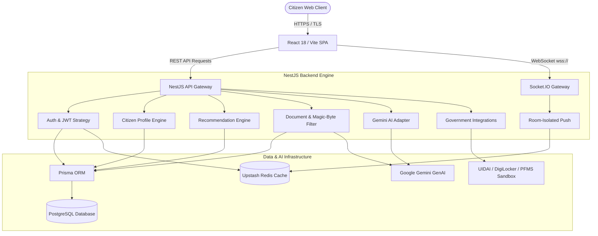

# BenefitOS

> An enterprise-grade, privacy-first digital welfare operating system connecting citizens to public welfare schemes through deterministic eligibility scoring, secure document vaults, and AI copilot guidance.

[](https://www.typescriptlang.org/)
[](https://react.dev/)
[](https://nestjs.com/)
[](https://www.postgresql.org/)
[](https://www.prisma.io/)
[](https://upstash.com/)
[](https://ai.google.dev/)
[](#security--data-isolation-engineering)

---

## 1. Project Overview

**BenefitOS** is a comprehensive, production-grade citizen welfare delivery and lifecycle management platform. Built to solve the systemic fragmentation in public sector benefit distribution, BenefitOS bridges the gap between citizens and state/central government welfare programs.

### Key Problems Solved
- **Information Asymmetry:** Citizens often miss entitled benefits due to complex criteria and fragmented portals.
- **Administrative Overhead:** Manual documentation reviews cause extensive delays and application backlogs.
- **Fraud & Impersonation:** Weak verification leads to duplicate claims and identity misuse.
- **Accessibility Barriers:** Complex bureaucratic jargon prevents underserved populations from applying successfully.

BenefitOS delivers automated eligibility matching, AI-assisted form guidance, zero-trust document security, and real-time status tracking in a clean, responsive web interface.

---

## 2. Key Capabilities

- 👤 **Citizen Profile Management:** Granular tracking of household income, domicile state, social categories (General, OBC, SC, ST, EWS), occupation, age, and family composition.
- 📋 **Welfare Scheme Discovery:** Searchable and filterable central/state catalog with benefit amounts and eligibility rules.
- ⚡ **Deterministic Recommendation Engine:** Automated eligibility scoring that evaluates citizen attributes against criteria (income caps, domicile rules, category prerequisites).
- 🤖 **AI Citizen Copilot:** Context-aware conversational AI assistant powered by Google Gemini (`gemini-3.6-flash`), with PII redaction filters for secure citizen queries.
- 📖 **Start-to-Finish Application Guidance:** AI-generated step-by-step instructions for every eligible scheme, paired with direct links to official government application portals.
- 🔒 **Secure Document Vault:** Encrypted document storage with magic-byte file signature validation (`%PDF`, `\xFF\xD8\xFF`, `\x89PNG`, `RIFF...WEBP`) to prevent file spoofing.
- 👁️ **Automated Vision OCR:** Document data extraction powered by Gemini Vision, parsing identity details and structured metadata automatically.
- 📑 **Application Workflow Tracking:** End-to-end lifecycle tracking (`DRAFT` → `SUBMITTED` → `UNDER_REVIEW` → `APPROVED` / `REJECTED`) with immutable audit trails.
- 🔔 **Omnichannel Notifications:** In-app feeds and real-time push alerts via WebSockets with per-user unread tracking.
- 🏛️ **Government Integration Architecture:** Sandbox-verified adapters for UIDAI Aadhaar OTP, DigiLocker OAuth2, PAN verification, and DBT/PFMS payment tracking.
- 🌐 **Real-Time WebSocket Gateway:** Authenticated Socket.IO namespace enforcing strict room isolation (`user:<userId>`) for live event delivery.
- 🌓 **Accessible 3-State Theme Engine:** Seamless `system | light | dark` switching with OS preference synchronization and anti-FOUT DOM class toggling.

---

## 3. Product Workflow

```
  [Citizen Registration & Profile Setup]
                    │
                    ▼
     [Deterministic Eligibility Engine] ──────► [Live AI Scheme Copilot]
                    │
                    ▼
     [Ranked Recommendations & Guidance]
                    │
                    ▼
     [Document Vault & Magic-Byte OCR]
                    │
                    ▼
   [Application Draft & Official Submission]
                    │
                    ▼
    [Real-Time Status Tracking & Alerts]
```

---

## 4. System Architecture



---

## 5. Technology Stack

| Layer | Technologies | Description |
|---|---|---|
| **Frontend** | React 18, TypeScript 5.7, Vite 6, Tailwind CSS, Zustand, React Query, Lucide Icons | Single Page Application with optimized bundle and zero-stale query cache |
| **Backend** | NestJS 11, Express 4, TypeScript, Passport.js, Zod, Helmet, Cookie Parser | Modular API monolith with global validation pipes and exception filters |
| **Database & Cache** | PostgreSQL 16 (Neon), Prisma ORM 6.3, Redis (Upstash / ioredis) | Parameterized relational models, pooled connections, and fail-closed state |
| **AI & Vision** | Google Gemini SDK (`@google/genai`), `gemini-3.6-flash` | Dual API client architecture for copilot chat and step-by-step guidance |
| **Security** | Argon2id, Passport JWT, Multer magic-byte validation, Throttler | Password hashing, object-level IDOR protection, and rate limiting |
| **Testing** | Node.js Test Runner, TypeScript Compiler, Jest | Security IDOR suites, multi-user isolation tests, and personas UAT |

---

## 6. Security & Data Isolation Engineering

BenefitOS enforces defense-in-depth security across all architectural layers:

1. **Password Hashing:** Passwords are hashed using **Argon2id** with salt and memory cost factors.
2. **Token Security:** Short-lived (15-minute) JWT access tokens paired with 7-day rotated refresh tokens in `httpOnly`, `secure`, `sameSite: strict` cookies.
3. **Role Isolation:** Registration strictly enforces `UserRole.CITIZEN`; any injected `"role": "ADMIN"` payload is stripped and rejected.
4. **Object-Level Authorization (IDOR Protection):** Every document, application draft, notification, and OCR result verifies ownership against the authenticated token subject (`@CurrentUser('sub')`).
5. **Magic-Byte Buffer Inspection:** File uploads undergo binary header signature checks (`%PDF`, `\xFF\xD8\xFF`, `\x89PNG`, `RIFF...WEBP`), blocking disguised executables (`MZ`, `\x7fELF`).
6. **Cross-Account Session Cache Isolation:** `queryClient.clear()` is executed on login and logout; all cache keys are scoped by `user?.id` to eliminate cross-session data bleeding.
7. **Redis Fail-Closed Mode:** In production distributed mode (`SECURITY_STATE_MODE=distributed`), session revocation checks strictly fail closed if Redis is unreachable.
8. **Anti-Enumeration Password Resets:** Password reset requests return uniform generic responses for existing and non-existing accounts, and tokens are single-use with SHA-256 hash validation.
9. **Secrets Cleanliness:** Zero `.env` files or credentials committed to Git. All secrets are read dynamically via `process.env`.

---

## 7. Testing & Verification

The codebase includes an extensive automated verification and regression suite:

```
============================================================
BENEFITOS AUTOMATED VERIFICATION RESULTS
============================================================
✔ Backend TypeScript Compilation (nest build)    : 0 errors
✔ Comprehensive Security & IDOR Suite             : 24 / 24 PASSED
✔ Multi-User PostgreSQL Isolation Test            : 4 / 4 PASSED (0 leaks)
✔ 5 Citizen Personas Eligibility UAT              : 5 / 5 PASSED
✔ Citizen Registration & Conflict Flow            : PASSED
✔ Password Reset & Anti-Replay Security           : PASSED
✔ Frontend TypeScript Check (tsc --noEmit)        : 0 errors
✔ Frontend Production Bundle (vite build)         : Built in 1.16s (246 modules)
✔ Dynamic 3-State Theme Engine Verification       : 4 / 4 PASSED
✔ Live Database Health Probe (/api/v1/health)     : Status OK (Database UP)
============================================================
```

---

## 8. API Overview (39 Verified Endpoints)

The backend provides 39 fully mapped, authenticated, and verified REST & WebSocket endpoints:

| Domain | Key Endpoints | Access Control |
|---|---|---|
| **Authentication** | `POST /auth/register`, `POST /auth/login`, `POST /auth/refresh`, `POST /auth/logout`, `POST /auth/forgot-password`, `POST /auth/reset-password` | Public / Rate-Limited / Cookie-Protected |
| **Citizen Profile** | `GET /citizens/me`, `PUT /citizens/me` | JWT Authenticated (Citizen) |
| **Welfare Schemes** | `GET /schemes`, `GET /schemes/:id` | Public Catalog |
| **Recommendations**| `GET /recommendations`, `POST /recommendations/recalculate` | JWT Authenticated (Citizen Scoped) |
| **Document Vault** | `POST /documents/upload`, `GET /documents`, `GET /documents/:id`, `DELETE /documents/:id` | JWT Authenticated (Magic-Byte Filtered / IDOR Protected) |
| **Vision OCR** | `POST /ocr/process/:documentId`, `GET /ocr/:documentId` | JWT Authenticated (IDOR Protected) |
| **Applications** | `POST /applications`, `POST /applications/draft`, `PUT /applications/:id`, `POST /applications/:id/submit`, `GET /applications`, `GET /applications/:id` | JWT Authenticated (IDOR Protected) |
| **AI Copilot** | `POST /ai/chat`, `POST /ai/explain-recommendation`, `POST /ai/scheme-instructions` | JWT Authenticated (Bounded 60s Timeout / Dual API Keys) |
| **Notifications** | `GET /notifications`, `PATCH /notifications/:id/read` | JWT Authenticated (User Scoped) |
| **Integrations** | `GET /integrations/digilocker/authorize`, `POST /integrations/digilocker/callback`, `POST /integrations/aadhaar/request-otp`, `POST /integrations/aadhaar/verify-otp`, `GET /integrations/dbt/status` | JWT Authenticated / OAuth2 Callback |
| **Health & Metrics**| `GET /health`, `GET /health/liveness`, `GET /health/readiness`, `GET /metrics` | Public (System Probes & Prometheus Scraper) |
| **Realtime Gateway**| `WS /ws` (Socket.IO namespace) | JWT Handshake (Private User Rooms `user:<userId>`) |

---

## 9. Repository Structure

```text
BenifitOS_FINAL/
├── apps/
│   ├── backend/                 # NestJS 11 Monolith API Gateway
│   │   ├── prisma/              # Database schema (schema.prisma) & seed files
│   │   └── src/
│   │       ├── common/          # Global Guards, Interceptors, & Filters
│   │       ├── config/          # Zod Environment Validation (env.config.ts)
│   │       ├── domain/          # Entities & Provider Interfaces
│   │       ├── infrastructure/  # AI Adapter, Database, Redis, & Government Adapters
│   │       └── modules/         # Auth, Citizen, Schemes, Documents, OCR, AI, etc.
│   └── frontend/                # React 18 / Vite 6 Single Page Application
│       └── src/
│           ├── components/      # UI Components & Theme Providers
│           ├── hooks/           # User-Scoped React Query Hooks
│           ├── screens/         # Dashboard, Schemes, Vault, Copilot, & Settings
│           ├── services/        # API Client & Axios Interceptors
│           └── store/           # Zustand Stores (Theme, Auth, Citizen)
├── scripts/                     # Automated Verification & Test Scripts
├── .env.example                 # Root Environment Variable Template
└── README.md                    # Authoritative Project Blueprint
```

---

## 10. Local Development Setup

### Prerequisites
- **Node.js:** v22 LTS (`node -v` >= 20.0.0)
- **Package Manager:** `npm` (v10+)
- **PostgreSQL:** Access to PostgreSQL 16 instance or Neon Serverless connection
- **Redis:** Redis instance or Upstash connection URL

### 1. Clone & Install Dependencies
```bash
git clone https://github.com/Divyanshgupta2580/BenifitOS_FINAL.git
cd BenifitOS_FINAL

# Install backend and frontend dependencies
cd apps/backend && npm install
cd ../frontend && npm install
cd ../..
```

### 2. Configure Environment
```bash
# Copy template to backend environment file
cp .env.example apps/backend/.env
```
Update `apps/backend/.env` with your `DATABASE_URL`, `JWT_SECRET`, and `GEMINI_API_KEY`.

### 3. Database Migration & Seeding
```bash
cd apps/backend
npx prisma generate
npx prisma migrate deploy
npm run prisma:seed
cd ../..
```

### 4. Start Development Servers
```bash
# Start Backend Gateway (Terminal 1)
cd apps/backend && npm run start:dev

# Start Frontend Client (Terminal 2)
cd apps/frontend && npm run dev
```
- Backend API Gateway: `http://localhost:4000/api/v1`
- Frontend Web App: `http://localhost:3000`

---

## 11. Environment Configuration

All environment variables are validated at startup via Zod (`apps/backend/src/config/env.config.ts`):

| Variable | Requirement | Default | Description |
|---|---|---|---|
| `PORT` | Optional | `4000` | HTTP listening port (Injected automatically by Render in prod) |
| `HOST` | Optional | `0.0.0.0` | Host binding for container routing |
| `NODE_ENV` | Optional | `development` | Runtime mode (`development`, `production`, `test`) |
| `DATABASE_URL` | **REQUIRED** | — | PostgreSQL connection string |
| `REDIS_URL` | Optional | `redis://localhost:6379` | Upstash / Redis connection URL |
| `JWT_SECRET` | **REQUIRED** | — | Secret key for signing access tokens (min 16 characters) |
| `JWT_REFRESH_SECRET` | **REQUIRED** | — | Secret key for signing refresh tokens (min 16 characters) |
| `JWT_EXPIRATION` | Optional | `15m` | Lifespan for JWT access tokens |
| `JWT_REFRESH_EXPIRATION` | Optional | `7d` | Lifespan for JWT refresh tokens |
| `GEMINI_MODEL` | Optional | `gemini-3.6-flash` | Gemini model identifier |
| `GEMINI_API_KEY` | Optional | — | Primary Google Gemini API key (Chatbot Copilot & OCR) |
| `GEMINI_SCHEME_GUIDANCE_API_KEY` | Optional | Defaults to `GEMINI_API_KEY` | Dedicated secondary Gemini key for scheme instructions |
| `SECURITY_STATE_MODE` | Optional | `local` | `local` (in-memory test fallback) or `distributed` (fail-closed in prod) |
| `CORS_ORIGIN` | Optional | — | Allowed frontend origin URL (e.g. `https://your-frontend.onrender.com` or `*`) |
| `SMTP_HOST` / `SMTP_PORT` / `SMTP_USER` / `SMTP_PASS` / `SMTP_FROM` | Optional | — | SMTP mail server credentials (optional; unconfigured mode active by default) |

---

## 12. Cloud Deployment (Render)

BenefitOS is pre-configured for Render Web Service deployment:

- **Root Directory:** `apps/backend`
- **Environment:** `Node`
- **Build Command:** `npm install --include=dev && npx prisma generate && npm run build`
- **Start Command:** `npm run start:prod`
- **Port Handling:** Automatically reads `process.env.PORT` supplied by Render
- **Host Binding:** `0.0.0.0`
- **Health Check Path:** `/api/v1/health`

---

## 13. Dual Gemini AI Architecture

To maximize quota efficiency and prevent chatbot usage from rate-limiting critical scheme guidance, BenefitOS utilizes a segregated dual-client AI design:

```
                      ┌────────────────────────────────────────┐
                      │          BenefitOS Backend             │
                      └──────────────────┬─────────────────────┘
                                         │
                 ┌───────────────────────┴───────────────────────┐
                 ▼                                               ▼
   ┌───────────────────────────┐                   ┌───────────────────────────┐
   │  Primary AI Client        │                   │  Secondary Guidance Client │
   │  (GEMINI_API_KEY)         │                   │  (GEMINI_SCHEME_GUIDANCE) │
   ├───────────────────────────┤                   ├───────────────────────────┤
   │ • Conversational Copilot  │                   │ • Start-to-Finish Scheme  │
   │ • Vision OCR Extraction   │                   │   Application Guidance    │
   │ • Recommendation Explainer│                   │ • Official Portal Linking │
   └─────────────┬─────────────┘                   └─────────────┬─────────────┘
                 │                                               │
                 └───────────────────────┬───────────────────────┘
                                         ▼
                         [Google Gemini 3.6-flash]
```

---

## 14. Known Limitations & Operational Notes

- **SMTP Email Dispatch:** SMTP is optional and currently unconfigured. Password reset tokens log local verification notices on the server. To enable real email delivery in production, configure SMTP environment variables.
- **Government Integrations:** Aadhaar OTP, DigiLocker OAuth2, and PFMS DBT adapters currently operate in sandbox-simulated modes for local testing and demonstration.
- **Cloud Deployment:** Local Render configuration has been verified (`PORT` injection and `0.0.0.0` binding). Cloud deployment execution requires linking the repository to your cloud provider.

---

## 15. License

This project is licensed under the terms of the **MIT License**.
