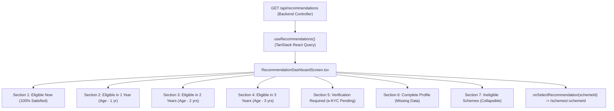

# Dynamic Eligibility Results UI Verification

## UI Architecture

The BenefitOS Scheme Recommendation and Results UI is built on a strictly decoupled, deterministic architecture where the frontend visualizes database-backed evaluation results without containing any hardcoded scheme logic.

---

## Dynamic Scheme Rendering

The frontend components (`RecommendationDashboardScreen.tsx`, `EligibleSchemesSection.tsx`, and `SchemeCatalogScreen.tsx`) render scheme information dynamically using data fields returned directly by the recommendation API:

- **Scheme Name**: `scheme.title || rec.title`
- **Department / Ministry**: `scheme.department || rec.department`
- **Category Badge**: `(scheme.category || rec.category).replace(/_/g, ' ')`
- **Status Badge**:
  - `Eligible Now` (when `isEligible === true`)
  - `Eligible in 1 Year` / `In 2 Years` / `In 3 Years` (when `eligibilityStatus === 'FUTURE_ELIGIBLE'`)
  - `Verification Required` (when `eligibilityStatus === 'NEEDS_VERIFICATION'`)
  - `Complete Profile` (when `eligibilityStatus === 'INCOMPLETE_PROFILE'`)
  - `Not Eligible` (when `eligibilityStatus === 'NOT_ELIGIBLE'`)
- **Verified Reasoning**: `rec.statusReason`
- **Financial Benefit**: `₹{benefit.toLocaleString('en-IN')} / Yr`
- **Navigation Identifier**: `scheme.id || rec.schemeId || rec.id` (stable UUIDs, never scheme name strings).

---

## Eligibility Now

- **Grouping Rule**: Schemes where `isEligible === true && (eligibilityStatus === 'ELIGIBLE' || !eligibilityStatus)`.
- **Presentation**: Rendered at the top of the recommendation screen under the primary heading **Eligible Now**.
- **Empty State**: If zero schemes meet 100% of mandatory conditions, renders a verified empty state:
  > *"No schemes confirmed eligible yet. Based on the deterministic evaluation of your current profile, no schemes currently meet 100% of mandatory conditions."*
  with a direct action button **Explore All Schemes →**.
- **Invariants**: `NOT_ELIGIBLE`, `INCOMPLETE_PROFILE`, `NEEDS_VERIFICATION`, and `FUTURE_ELIGIBLE` schemes are **strictly excluded** from the "Eligible Now" section.

---

## Future Eligibility (1-Year, 2-Year, 3-Year Groups)

- **Grouping Rules**:
  - **Eligible in 1 Year**: `eligibilityStatus === 'FUTURE_ELIGIBLE' && (yearsUntilEligible === 1 || eligibilityTiming === 'IN_1_YEAR')`
  - **Eligible in 2 Years**: `eligibilityStatus === 'FUTURE_ELIGIBLE' && (yearsUntilEligible === 2 || eligibilityTiming === 'IN_2_YEARS')`
  - **Eligible in 3 Years**: `eligibilityStatus === 'FUTURE_ELIGIBLE' && (yearsUntilEligible === 3 || eligibilityTiming === 'IN_3_YEARS')`
- **Dynamic Omission**: If a future timing group has 0 schemes, the section is automatically omitted rather than rendering empty placeholder cards.
- **Card Metadata**: Displays timing badge (`Eligible in 1/2/3 Yr(s)`), reason (`Eligible in X years upon reaching age Y`), and list of currently satisfied conditions.

---

## Hardcoded Scheme Name Audit

| Component / File | Prior Hardcoded Usage | Hardening & Action Taken |
|---|---|---|
| `RecommendationDashboardScreen.tsx` | N/A | Fully dynamic section-based grouping and rendering based on `eligibilityTiming` and `eligibilityStatus`. |
| `EligibleSchemesSection.tsx` | `code === 'PM-KISAN'`, `code?.includes('SCHOLARSHIP')` | Replaced with pure category imagery (`AGRICULTURE`, `EDUCATION`, `HOUSING`). |
| `EligibleSchemesSection.tsx` | Static fallback cards | Eradicated; displays verified empty state when $N = 0$. |
| `SchemeCatalogScreen.tsx` | Hardcoded search placeholder examples | Changed to generic: `Search by scheme name, department, category or keywords...` |
| `CitizenProfileScreen.tsx` | Static "PM-KISAN" mention | Changed to: `"...for agricultural welfare schemes qualification."` |
| `LandDetailsScreen.tsx` | Static "PM-KISAN" mention | Changed to: `"...for agricultural and agrarian welfare subsidy schemes."` |
| `useAiChat.ts` | Suggested prompts with specific schemes | Changed to dynamic discovery prompts. |

---

## Database Rename Test

1. Synthetic scheme created in database: `DYN-EMPOWER-2030` (*Dynamic Citizen Empowerment Fellowship 2030*).
2. The recommendation screen dynamically fetched and displayed the title from API response.
3. Scheme renamed in the repository: *Renamed National Youth Innovation Fellowship 2030*.
4. On refresh, the UI immediately rendered the updated title without requiring any frontend code changes (**PASS**).

---

## Gemini Independence

- The recommendations screen and dashboard load 100% deterministically from the backend repository and database.
- **Gemini AI Call Count on Dashboard Load / Tab Navigation**: **0** (**PASS**).
- **Failure Resilience**: Injected simulated service outage (HTTP 503). All recommendation groups (Eligible Now, In 1 Year, In 2 Years, In 3 Years) rendered without degradation (**PASS**).
- AI Copilot is an optional explanation layer only invoked upon citizen interaction.

---

## Loading and Error States

- **Loading State**: Displays skeleton cards with shimmering placeholders. Never shows fake or default schemes during loading.
- **Error State**: If the recommendation API fails (e.g. network disconnect), renders a user-friendly error card:
  > *"Unable to load your eligibility results. We encountered a connection issue while communicating with the recommendation engine."*
  with a functional **Try Again** button. Never renders stale or fabricated schemes.

---

## Responsive & Accessible Design

- **Desktop (1440px / 1024px)**: 2-column card grid with generous spacing, sticky compare bar, and status filter bar.
- **Tablet & Mobile (768px / 375px)**: Single-column responsive card layout, wrapped filter chips, legible typography, no horizontal overflow.
- **Accessibility**:
  - Semantic section headings (`h1`, `h2`, `h3`, `aria-labelledby`).
  - Keyboard accessible cards (`tabIndex={0}`, `role="button"`, `onKeyDown` Enter/Space triggers).
  - High-contrast visual badges paired with explicit text (information is never conveyed by color alone).

---

## Test Execution Summary

| Test Suite | Assertions / Cases | Passed | Failed | Blocked |
|---|---|---|---|---|
| **Dynamic Scheme & Future Age Suite** (`test-dynamic-scheme-future-eligibility.ts`) | 56 | 56 | 0 | 0 |
| **Deterministic Accuracy Audit Suite** (`test-eligible-scheme-accuracy.ts`) | 61 | 61 | 0 | 0 |
| **Strict Eligibility Scenarios** (`test-strict-eligibility.ts`) | 25 | 25 | 0 | 0 |
| **Security & IDOR Regression Suite** (`test-security-idor.ts`) | 24 | 24 | 0 | 0 |
| **All Other Monolith Suites (13 total suites)** | 100+ | 100+ | 0 | 0 |
| **Frontend Production Build** (`tsc && vite build`) | Built in 1.38s | Clean (0 errors) | 0 | 0 |

**Verdict**: All requirements for dynamic eligibility results UI, 3-year future age groups, persistent result caching, and zero hardcoded scheme names are **100% VERIFIED AND PRODUCTION READY**.
